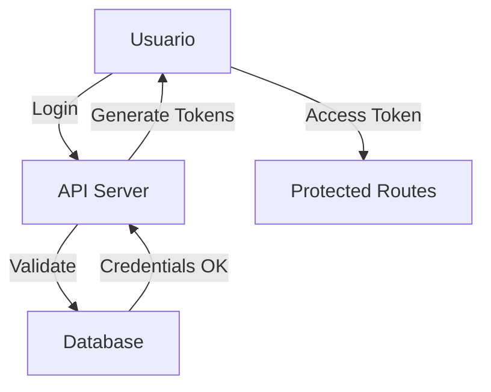
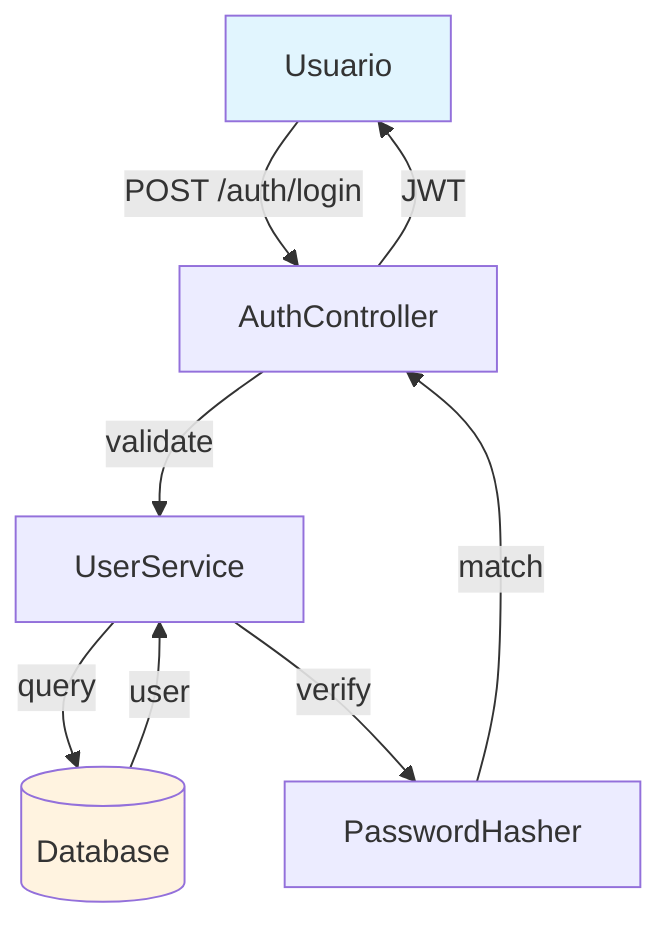

# Fase 2: Generación del Wiki

## Creación de Documentación Automática

Una vez que el repositorio está indexado, el sistema genera documentación interactiva con diagramas, tablas y explicaciones técnicas.

**Archivos principales:**
- Frontend: `src/app/[owner]/[repo]/page.tsx`
- Backend: `api/websocket_wiki.py`, `api/prompts.py`

---

## 1. Flujo de Generación del Wiki

```
┌─────────────────────────────────────────────────────────────────────────┐
│                    FLUJO: GENERACIÓN DEL WIKI                         │
├─────────────────────────────────────────────────────────────────────────┤
│                                                                         │
│  ┌──────────────┐    ┌──────────────┐    ┌──────────────┐            │
│  │ File Tree   │───▶│    LLM       │───▶│  Estructura  │            │
│  │ + README    │    │  (Prompt)    │    │    XML       │            │
│  └──────────────┘    └──────────────┘    └──────┬───────┘            │
│                                                  │                     │
│                                                  ▼                     │
│  ┌──────────────┐    ┌──────────────┐    ┌──────────────┐          │
│  │   Cache     │◀───│   LLM         │◀───│   Contenido  │          │
│  │  Storage    │    │  (Streaming) │    │    por Page  │          │
│  └──────────────┘    └──────────────┘    └──────────────┘          │
│                                                                         │
└─────────────────────────────────────────────────────────────────────────┘
```

---

## 2. Obtención del File Tree

**Ubicación:** `src/app/[owner]/[repo]/page.tsx:1132-1300`

Antes de generar documentación, el sistema necesita conocer la estructura del proyecto.

### Fuentes de Información

```typescript
// Obtener de GitHub/GitLab API o filesystem local
const sources = [
  GitHub API: "https://api.github.com/repos/{owner}/{repo}/contents",
  GitLab API: "https://gitlab.com/api/v4/projects/{id}/repository/tree",
  Local: "~/.adalflow/repos/{owner}_{repo}/"
];
```

### Estructura Obtenida

```
src/
├── components/
│   ├── Button.tsx
│   ├── Modal.tsx
│   └── Header.tsx
├── pages/
│   ├── index.tsx
│   └── about.tsx
├── utils/
│   ├── api.ts
│   └── helpers.ts
├── styles/
│   └── globals.css
├── package.json
└── README.md
```

### README como Contexto

El sistema también obtiene el `README.md` del repositorio para dar contexto inicial sobre el proyecto.

---

## 3. Generación de Estructura del Wiki

**Ubicación:** `src/app/[owner]/[repo]/page.tsx:700-798`

El primer paso es pedirle al LLM que proponga una estructura de documentación.

### Prompt de Estructura

```python
# Construido en el frontend (page.tsx)
prompt = f"""
Analiza la estructura del siguiente repositorio y crea una estructura de wiki.

File Tree:
{file_tree}

README:
{readme_content}

Crea una estructura de wiki con 8-12 páginas que cubra:
- Visión general del proyecto
- Arquitectura y componentes principales
- Funcionalidades clave
- Setup e instalación
- Configuración
- Uso de APIs
- Casos de uso comunes
- Contribución

Responde en formato XML:
"""
```

### Respuesta XML Esperada

```xml
<wiki_structure>
  <title>Mi Proyecto - Documentación</title>
  <description>Una aplicación web moderna para gestión de tareas</description>
  
  <sections>
    <section id="getting-started">
      <title>Comenzando</title>
      <pages>
        <page_ref>installation</page_ref>
        <page_ref>quick-start</page_ref>
      </pages>
    </section>
    
    <section id="architecture">
      <title>Arquitectura</title>
      <pages>
        <page_ref>overview</page_ref>
        <page_ref>components</page_ref>
        <page_ref>state-management</page_ref>
      </pages>
    </section>
    
    <section id="api">
      <title>API Reference</title>
      <pages>
        <page_ref>endpoints</page_ref>
        <page_ref>authentication</page_ref>
      </pages>
    </section>
  </sections>
  
  <pages>
    <page id="overview">
      <title>Visión General</title>
      <importance>high</importance>
      <relevant_files>
        <file_path>package.json</file_path>
        <file_path>README.md</file_path>
      </relevant_files>
    </page>
    
    <page id="installation">
      <title>Instalación</title>
      <importance>high</importance>
      <relevant_files>
        <file_path>package.json</file_path>
        <file_path>.env.example</file_path>
      </relevant_files>
    </page>
    
    <page id="components">
      <title>Componentes</title>
      <importance>high</importance>
      <relevant_files>
        <file_path>src/components/Button.tsx</file_path>
        <file_path>src/components/Modal.tsx</file_path>
        <file_path>src/components/Header.tsx</file_path>
      </relevant_files>
    </page>
    
    <!-- Más páginas... -->
  </pages>
</wiki_structure>
```

### Campos Importantes

| Campo | Descripción |
|-------|-------------|
| `importance` | Prioridad: `high`, `medium`, `low` |
| `relevant_files` | Archivos que el LLM debe leer para generar el contenido |
| `pages` | Cada página individual con su contenido |

---

## 4. Generación de Contenido por Página

**Ubicación:** `src/app/[owner]/[repo]/page.tsx:372-600`

Una vez definida la estructura, el sistema genera contenido para cada página.

### Proceso por Página

```
1. Obtener relevant_files de la página
2. Leer contenido de esos archivos (usando RAG o directamente)
3. Construir prompt detallado
4. Enviar a LLM via WebSocket
5. Recibir streaming response
6. Renderizar Markdown + Mermaid
```

### Prompt de Contenido

```python
# Construido en page.tsx:419-526
prompt = f"""
Eres un experto técnico escribiendo documentación.

Instrucciones:
- Escribe en formato técnico profesional
- Incluye diagramas Mermaid para visualizar conceptos
- Usa tablas para APIs y configuraciones
- Incluye ejemplos de código con sintaxis
- Cita las fuentes de código (file:line)

Idioma: Español

Contenido solicitado: {page_title}

Archivos relevantes:
{relevant_files_content}

Genera la documentación completa:
"""
```

### Tipos de Contenido Generado

#### Descripciones Técnicas

```markdown
## Autenticación

El sistema de autenticación utiliza JWT tokens con refresh tokens...

### Flujo de Login

1. El usuario ingresa credenciales
2. El servidor valida contra la base de datos
3. Genera access token (15 min) y refresh token (7 días)
4. Retorna tokens al cliente
```

#### Diagramas Mermaid

El LLM genera diagramas automáticamente:



**Tipos de diagramas soportados:**
- Flow charts: `graph TD` o `graph LR`
- Sequence diagrams
- Class diagrams
- ER diagrams

#### Tablas

```markdown
### Endpoints de Autenticación

| Método | Endpoint | Descripción |
|--------|----------|-------------|
| POST | /auth/login | Iniciar sesión |
| POST | /auth/logout | Cerrar sesión |
| POST | /auth/refresh | Refresh token |
| GET | /auth/me | Datos usuario |
```

#### Snippets de Código

```python
def authenticate_user(email: str, password: str) -> dict:
    """
    Autentica un usuario contra la base de datos.
    
    Args:
        email: Email del usuario
        password: Contraseña sin hashear
    
    Returns:
        Dict con access_token y refresh_token
    
    Raises:
        InvalidCredentialsError: Si las credenciales son inválidas
    """
    user = db.users.find_one({"email": email})
    if not user or not verify_password(password, user["hash"]):
        raise InvalidCredentialsError()
    
    return {
        "access_token": create_access_token(user),
        "refresh_token": create_refresh_token(user)
    }
```

#### Citas de Código Fuente

```markdown
La función principal se encuentra en `src/utils/auth.py:15-32`:

> La validación de passwords usa bcrypt con 12 rounds de sal
```

---

## 5. Streaming de Contenido

**Backend:** `api/websocket_wiki.py`

### WebSocket Connection

```python
# Frontend
const ws = new WebSocket("ws://localhost:8001/ws/chat");

ws.onmessage = (event) => {
  const chunk = event.data;
  // Acumular y renderizar en tiempo real
};
```

### Protocolo de Mensajes

```json
// Envío (Frontend → Backend)
{
  "repo_url": "https://github.com/owner/repo",
  "messages": [{"role": "user", "content": "Genera la página de..."}],
  "provider": "google",
  "model": "gemini-2.5-flash",
  "language": "es"
}

// Recepción (Backend → Frontend) - Streaming
"## Visión General\n\n"
"Este proyecto es una aplicación..."
"```mermaid\ngraph TD\n..."
```

---

## 6. Renderizado en Frontend

### Componentes de Renderizado

| Componente | Propósito |
|------------|-----------|
| `Markdown.tsx` | Renderiza Markdown a HTML |
| `Mermaid.tsx` | Convierte texto Mermaid a diagramas SVG |

### Markdown Rendering

```tsx
import ReactMarkdown from 'react-markdown';
import remarkGfm from 'remark-gfm';

<ReactMarkdown remarkPlugins={[remarkGfm]}>
  {contenido_generado}
</ReactMarkdown>
```

### Mermaid Rendering

```tsx
import mermaid from 'mermaid';

mermaid.initialize({
  startOnLoad: true,
  theme: 'default',
  securityLevel: 'loose',
});

// Para renderizar
const { svg } = await mermaid.render('diagram-id', codeMermaid);
```

### Diagrama Resultado



---

## 7. Cache del Wiki

**API:** `api/api.py:403-538`

### Almacenamiento

**Ubicación:** `~/.adalflow/wikicache/`

```
~/.adalflow/wikicache/
├── deepwiki_cache_github_AsyncFuncAI_deepwiki-open_es.json
├── deepwiki_cache_github_owner_myapp_en.json
└── deepwiki_cache_gitlab_owner_project_es.json
```

### Estructura del Cache

```python
@dataclass
class WikiCacheData:
    wiki_structure: WikiStructureModel  # Estructura XML
    generated_pages: Dict[str, WikiPage]  # Contenido por página
    repo: RepoInfo  # Info del repo
    provider: str   # Proveedor LLM usado
    model: str     # Modelo LLM usado
```

### Endpoints de Cache

| Método | Endpoint | Descripción |
|--------|----------|-------------|
| GET | `/api/wiki_cache` | Obtener wiki cacheado |
| POST | `/api/wiki_cache` | Guardar wiki generado |
| DELETE | `/api/wiki_cache` | Eliminar cache |

---

## 8. Navegación del Wiki

### WikiTreeView

```tsx
// Sidebar con estructura jerárquica
<WikiTreeView>
  <Section title="Comenzando">
    <PageLink id="installation">Instalación</PageLink>
    <PageLink id="quick-start">Inicio Rápido</PageLink>
  </Section>
  <Section title="Arquitectura">
    <PageLink id="overview">Visión General</PageLink>
    <PageLink id="components">Componentes</PageLink>
  </Section>
  <Section title="API">
    <PageLink id="endpoints">Endpoints</PageLink>
    <PageLink id="authentication">Autenticación</PageLink>
  </Section>
</WikiTreeView>
```

### Cross-References

Las páginas incluyen enlaces a páginas relacionadas:

```markdown
## Véase También

- [Configuración](./config) - Opciones de configuración
- [Deployment](./deployment) - Despliegue en producción
```

---

## 9. Resumen del Pipeline

```
┌─────────────────────────────────────────────────────────────────────────┐
│                    RESUMEN: GENERACIÓN WIKI                             │
├─────────────────────────────────────────────────────────────────────────┤
│                                                                         │
│  1. FILE TREE                                                          │
│     API GitHub/GitLab → Estructura de directorios                     │
│     + README.md como contexto                                          │
│                                                                         │
│  2. ESTRUCTURA (LLM)                                                   │
│     Prompt → XML con 8-12 páginas                                      │
│     + relevance_files por página                                      │
│                                                                         │
│  3. CONTENIDO (por página)                                             │
│     a) Leer archivos relevantes                                        │
│     b) Prompt detallado + Mermaid requirements                        │
│     c) Streaming LLM                                                  │
│     d) Render: Markdown + Mermaid → SVG                                │
│                                                                         │
│  4. CACHE                                                              │
│     JSON → ~/.adalflow/wikicache/                                      │
│                                                                         │
│  5. NAVEGACIÓN                                                         │
│     WikiTreeView + Cross-references                                   │
│                                                                         │
└─────────────────────────────────────────────────────────────────────────┘
```

---

## 10. Implementación Propia: Guía Rápida

### Paso 1: Obtener File Tree

```python
import requests

def get_github_tree(owner, repo, token):
    url = f"https://api.github.com/repos/{owner}/{repo}/contents"
    headers = {"Authorization": f"token {token}"}
    response = requests.get(url, headers=headers)
    return response.json()  # Lista de archivos
```

### Paso 2: Generar Estructura

```python
def generate_structure(tree, readme):
    prompt = f"""
    Crea estructura de wiki en XML para este repositorio:
    {tree}
    README: {readme}
    """
    response = openai.ChatCompletion.create(
        model="gpt-4",
        messages=[{"role": "user", "content": prompt}]
    )
    return parse_xml(response.choices[0].message.content)
```

### Paso 3: Generar Página

```python
def generate_page(page_info, relevant_files):
    prompt = f"""
    Genera documentación técnica con:
    - Descripciones
    - Diagramas Mermaid
    - Tablas
    - Código
    Archivos: {relevant_files}
    """
    # Streaming response
    for chunk in openai.ChatCompletion.create(
        model="gpt-4",
        messages=[{"role": "user", "content": prompt}],
        stream=True
    ):
        yield chunk.delta.content
```

### Paso 4: Renderizar

```python
import markdown
import mermaid

def render(content):
    html = markdown.markdown(content)
    # Detectar bloques mermaid
    # render_mermaid_blocks(html)
    return html
```

---

## Siguiente Paso

El wiki generado es estático. La **Fase 3** implementa un chat dinámico
que permite hacer preguntas específicas sobre el código.

➡️ **[04-chat-rag.md](04-chat-rag.md)**

---

## Referencias

| Componente | Archivo | Líneas |
|------------|---------|--------|
| Wiki page | `src/app/[owner]/[repo]/page.tsx` | 372-600 |
| Estructura | `src/app/[owner]/[repo]/page.tsx` | 700-798 |
| WebSocket | `api/websocket_wiki.py` | - |
| Prompts | `api/prompts.py` | - |
| Cache API | `api/api.py` | 403-538 |
| Markdown | `src/components/Markdown.tsx` | - |
| Mermaid | `src/components/Mermaid.tsx` | - |
